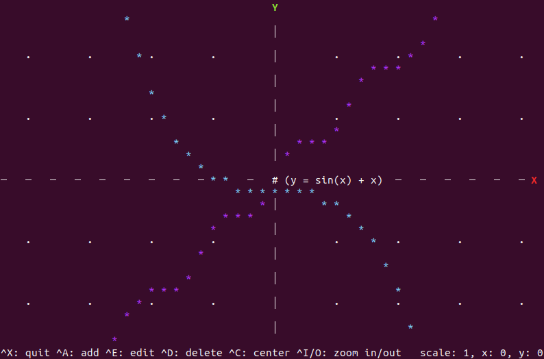
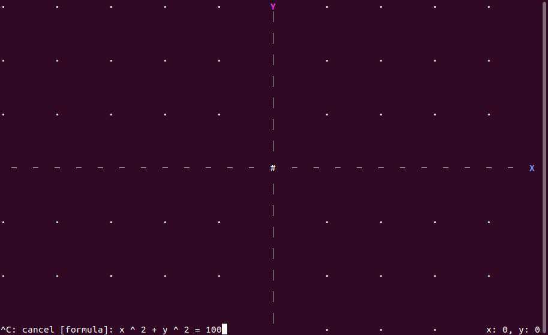

ttyGraph
==========

A graph viewer for character user interface.

Installation
----------
You can download pre-compiled binary file from below, or choose to build from source code.

Linux: [ttygraph-linux-latest.tar.gz](./releases/ttygraph-linux-latest.tar.gz)

### Build from source code
#### Prerequisites
This program is written in Rust. So you need to install Rust and Cargo by reading [rust-lang.org](https://www.rust-lang.org/tools/install).

#### Build  
Clone this repository to your computer by running:  
`git clone https://github.com/makutamoto/ttygraph.git`

In the cloned directory, run:  
`cargo run`

Usage
----------

The center positioned `#` is a cursor. You can select a graph by overlapping with this.

* `arrow keys` : move around the coordinate plane
* `ctrl` + `X` : quit this program
* `ctrl` + `A` : add a new graph
* `ctrl` + `E` : edit a selected graph
* `ctrl` + `D` : delete a selected graph
* `ctrl` + `C` : back to center (origin)

### Inputting a formula

This program use mathematical formulae to display graphs such as `x ^ 2 + y ^ 2 = 100` as shown in the above image.

Formulae must conform to this syntax: `[left] = [right]`

#### Supported Operators
* `^` : Power
* `*` : Multiplication
* `/` : Division
* `%` : Modulus
* `+` : Addition
* `-` : Subtraction

#### Supported Functions
* `abs(A)`: *A* is the number you want to calculate the absolute value.
* `sin(B)`
* `cos(B)`: *B* is the angle in radians.
* `tan(B)`

Other functions (round, floor, etc.) will be available for later versions.

License
----------
ttyGraph is released under GPLv3.0.
